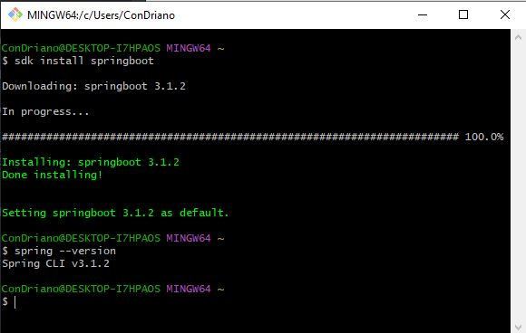

# Spring Boot Installation for Windows

## Requirements

For building and running the application you need:

- [Git Bash](https://git-scm.com/downloads)
- [JDK 17](https://bell-sw.com/pages/downloads/#/java-17-lts)
- [Eclipse IDE](https://www.eclipse.org/downloads/)
- zip library for bash
- [SDKMAN](https://sdkman.io/)
- Spring Boot CLI
- Gradle (encourage to install despite already shipped with eclipse)

## Steps

- Install Git Bash. We will be using bash for all commands in this tutorial. Skip if already installed in your machine.
- Install JDK 17 and make sure **JAVA_HOME** is set in system environment.
- Verify java installation by running `java -version`. Restart bash if opened.
- Before curling SDKMAN, SDKMan need **zip**, which is not included by Windows Git Bash by default.
- To resolve this, go to [sourceforge](https://sourceforge.net/projects/gnuwin32/files/zip/3.0/) and find **zip** in the list. Download **zip-3.0-bin.zip** and extract. Get **zip.exe** in the **bin** folder and copy it to **C:\Program Files\Git\usr\bin**. Restart your bash.
- Install SDKMAN by running:
    ```$ curl -s "https://get.sdkman.io" | bash```
- Restart your bash.
- Install Spring Boot CLI by using following command
  ```
  $ sdk install springboot
  $ spring --version
  Spring CLI v3.1.2
  ```
  
> your prompt should be as above. If there is error when running version checking, you might want to restart your machine

- Run this line for command-line completion:
  ```$ . ~/.sdkman/candidates/springboot/current/shell-completion/bash/spring```.
- You need a build tool, either Maven or Gradle to supports dependency management. For now, we will use Gradle. Run following command to install Gradle:
    ```$ sdk install gradle 8.2.1```
- Then run version check on Gradle:
  ```$ gradle -v```
- If command above not working, restart your bash.
- Install Eclipse IDE. Change Java 17+ VM to LibericaJDK-17

## Developing First Spring Boot Application

This section describes how to develop a small “Hello World!” web application that highlights some of Spring Boot’s key features. You can choose between Maven or Gradle as the build system.

- Go to [spring initializr](https://start.spring.io/)
- Page will automatically detect and set based on your system setup earlier. Click `Generate` button.
- `demo.zip` will be downloaded to your machine. Extract it.
- Since we are developing a web application, we add a `spring-boot-starter-web` dependency. Before that, we can look at what we currently have by running the following command in demo root folder:
    ```
    $ gradle dependencies
    ```
- The gradle dependencies command prints a tree representation of your project dependencies. Right now, the project has no dependencies. To add the necessary dependencies, edit your `build.gradle` and add the `spring-boot-starter-web `dependency in the dependencies section:

    ```
    dependencies {
        implementation 'org.springframework.boot:spring-boot-starter-web'
    }
    ```
- If you run `gradle dependencies` again, you see that there are now a number of additional dependencies, including the Tomcat web server and Spring Boot itself.
- To finish our application, we need to update main Java file. By default, Maven and Gradle compile sources from src/main/java.
- Open your eclipse IDE and locate source folder and then import it in your IDE. Locate `DemoApplication.java` in `demo\src\main\java\com\example\demo`
- Update file with following lines:
  ```
    package com.example.demo;

    import org.springframework.boot.SpringApplication;

    import org.springframework.boot.autoconfigure.SpringBootApplication;
    import org.springframework.web.bind.annotation.RequestMapping;
    import org.springframework.web.bind.annotation.RestController;

    @RestController
    @SpringBootApplication
    public class DemoApplication {

        @RequestMapping("/")
        String home() {
            return "Hello World!";
        }
        
        public static void main(String[] args) {
            SpringApplication.run(DemoApplication.class, args);
        }
    }
  ```
- Save and run the code. You can now access to [localhost:8080](http://localhost:8080) with Hello World printed in your browser.